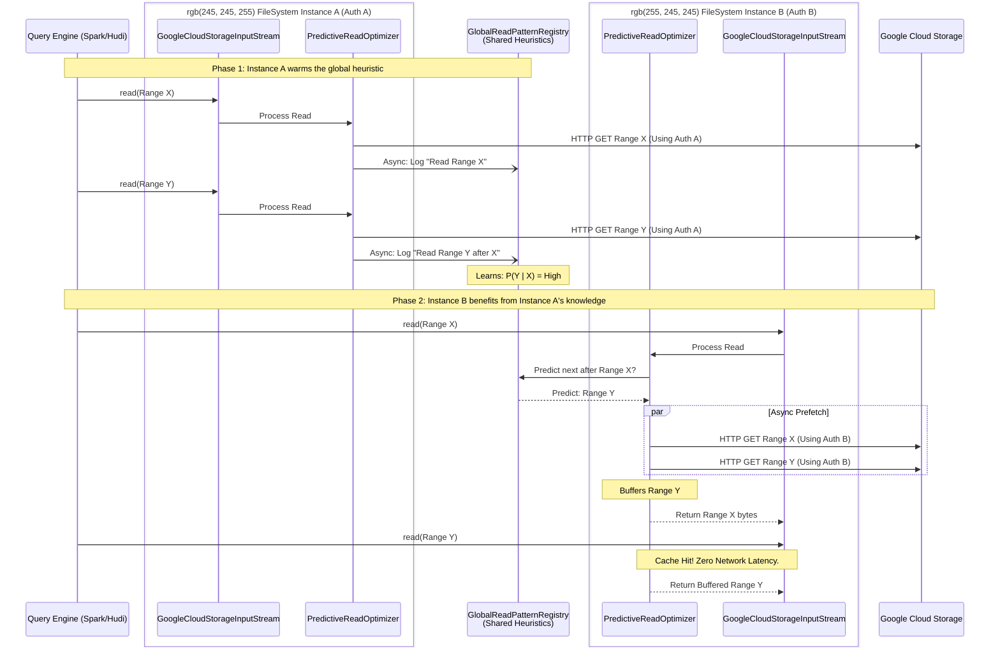

# Design Doc: Cross-Instance Predictive Prefetching Heuristics

## 1. Objective
Design a predictive prefetching layer for `gcs-analytics-core` that anticipates future byte-range read requests based on query access patterns. The model must safely share heuristic knowledge globally across isolated `GcsFileSystem` instances without risking cross-tenant credential leaks or unauthorized data access.

## 2. Problem Statement
Currently, optimizations like the Footer and Small Object caches in `gcs-analytics-core` are tightly bound to the lifecycle of a `GcsFileSystem` instance. While this guarantees security (credentials and decrypted byte data are strictly isolated), it prevents "cold" instances from benefiting from the warmed-up knowledge of other instances.
By shifting from **caching raw data** to **caching behavioral metadata** (mathematical probabilities of access patterns), we can globally optimize I/O across all JVM threads safely.

---

## 3. Implementation Options

### Option 1: Statistical Markov Chain (Transition Matrix)
Discretize files into logical byte ranges. Maintain a global transition matrix that learns: *Given the engine just read Range A, what is the probability it reads Range B next?*
*   **Pros:** Extremely low CPU overhead, microsecond inference latency, easy to share globally via concurrent Java data structures.
*   **Cons:** Can be memory-intensive if the matrix grows unbounded; requires strict LRU eviction.

### Option 2: Format-Aware Metadata Layout Cache (Structural Parser)
Parse the structural metadata of specific file formats (e.g., Parquet footers) globally. Map exactly where row groups and column chunks live to prefetch them deterministically.
*   **Pros:** 100% accurate layout mappings.
*   **Cons:** Anti-pattern for a low-level I/O library. Forces duplicate metadata parsing (the query engine already does this), bloats dependencies (`parquet-hadoop`, etc.), and cannot predict *what* columns a query actually intends to read, only *where* they live.

### Option 3: Frequent Itemset / Association Rule Learning
Treat each query's vectored reads as a "basket" of byte ranges. Use algorithms (like FP-Growth) to find associated ranges. (e.g., "Queries reading range `[1000-2000]` almost always read `[8000-9000]`").
*   **Pros:** Perfect for columnar analytics where `SELECT name, age` consistently translates to the exact same disjoint byte ranges.
*   **Cons:** Requires batch/background calculation rather than instantaneous updates.

### Option 4: Embedded ML Sequence Model (RNN/Transformer)
Embed a lightweight ONNX model inside the JVM to feed a sequence of requested offsets into a neural network to predict the next `(offset, length)` tuple.
*   **Pros:** Can learn highly complex, non-linear access patterns.
*   **Cons:** Very high inference latency on the hot I/O path. Heavy dependency footprint.

---

## 4. Recommendation & Rationale
**Recommendation: A hybrid of Option 1 (Markov Chain) and Option 3 (Frequent Itemsets).**

We explicitly reject Option 2 (Format-Aware Parser) because of the **"Map vs. Journey" problem**. Parsing a Parquet file gives the storage layer a *map* of the file, but it doesn't tell it the *journey* (what columns the user's SQL query actually selected). Behavioral heuristics (Options 1 & 3) learn the journey by observing real access patterns, allowing the library to proactively fetch data while keeping the I/O layer completely agnostic to file formats.

---

## 5. Implementation Plan

### Phase 1: Global Read Pattern Registry
Create a thread-safe singleton, `GlobalReadPatternRegistry`. It operates outside the `GcsFileSystem` boundary and holds **no credentials and no byte data**. It simply maps `GcsItemId` to a graph of historical `(offset, length)` access frequencies.

### Phase 2: The PredictiveReadOptimizer
Implement `PredictiveReadOptimizer` (extending `FormatOptimizer`).
*   **Observation:** It asynchronously records the ranges requested via `read()` and `readVectored()` into the global registry.
*   **Prediction:** Before making an HTTP GET, it queries the registry: *"Given the current offset, what are the highest probability next ranges?"*

### Phase 3: Asynchronous Prefetching
When high-probability future ranges are identified, the optimizer dispatches an asynchronous fetch to the `GcsFileSystem`'s vectored read thread pool. Because this fetch uses the local `GoogleCloudStorageInputStream` context, it inherently uses the correct, isolated credentials.

### Phase 4: Cache Interception
The pre-fetched bytes are placed into the local `AnalyticsCacheManager`. When the query engine predictably requests those bytes milliseconds later, they are served instantly from memory.

---

## 6. Architecture & Flow Diagram

The following diagram illustrates how the Global Heuristic Model aggregates knowledge without violating the credential boundaries of the individual FileSystem instances.

